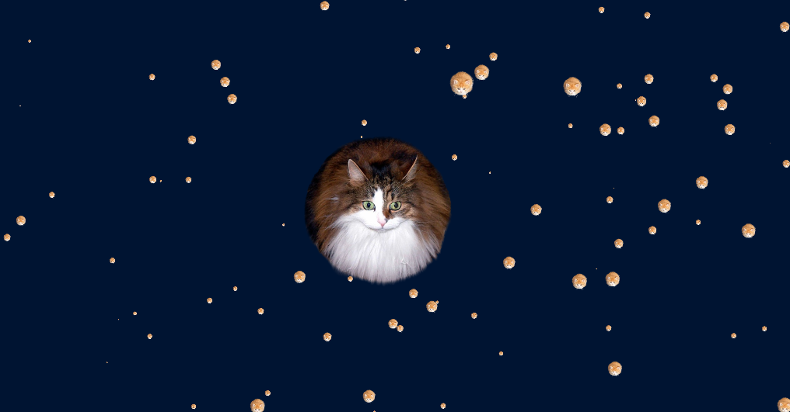

# Osmosim

**An Osmos-inspired particle simulator written in C++**



*A 2D simulation of circular bodies interacting via collisions and osmosis, using a grid-based spatial partitioning structure. Uses raylib for rendering*

## 📥 Installation & Compilation

### **Dependencies**
Ensure you have the following installed:
- **C++ Compiler** (g++ or clang++)
- **raylib** (via package manager or built from source)
- **Make** (for compiling the project)

### **Building the Project**
Optional make arguments are DEBUG=1 and MINGW=1
```sh
git clone https://github.com/QVRE/Osmosim.git
cd Osmosim
make
```

### **Running the Simulator**
After compilation, run the binary:
```sh
./osmosim
```

## ⚙️ Controls
| Key | Action |
|------|---------|
| `Q` | Exit the simulation |
| `SPACE` | Pause/Resume |
| `F1` | Open menu |
| `,` `.` | Adjust simulation speed |

## 📜 License
This project is licensed under the **GPLv3 License** – [See the license file](LICENSE) for details.

## 📬 Contact
For questions, suggestions, or contributions, feel free to reach out via:
- GitHub Issues: [https://github.com/QVRE/Osmosim/issues](https://github.com/QVRE/Osmosim/issues)
- Email: *nikos.raudonus@gmail.com*
